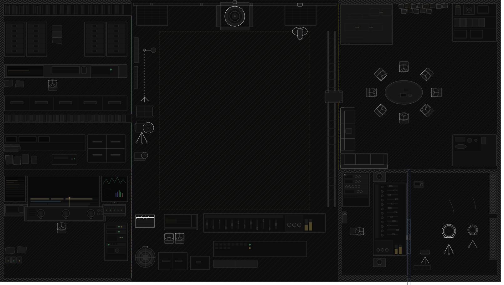

<div align="center">


### 把“如果当时……”变成一部属于你的平行电影。

一条灵感、一部喜欢的影视作品，交给一支会倾听的 AI 虚拟剧组：它们讨论、提案、分工，
而你在关键选择上按下自己的导演键。

<p>
  <a href="#快速开始">快速开始</a> ·
  <a href="#核心体验">核心体验</a> ·
  <a href="#架构">架构</a> ·
  <a href="#路线图">路线图</a>
</p>


<br />
<a href="http://127.0.0.1:5180"><strong>▶ 打开创作工作台</strong></a>
&nbsp;&nbsp;·&nbsp;&nbsp;
<a href="#快速开始"><strong>开始部署</strong></a>

</div>

---

<p align="center">
  
</p>

<p align="center"><sub>一个可视化的虚拟片场：档案库、导演席、剪辑台与观影区，共同组成你的二创工作台。</sub></p>

---

## 从一句话，到一场真正的创作会议

你输入一句话：

> "《哈利波特与凤凰社》我不接受这个结局，小天狼星必须活下来。"

剩下的交给剧组：导演们开会、争论、提案、分工，最后给你一份可执行的平行结局方案。
你可以随时插话，也可以等系统在关键分歧处递来一张选择卡。

---

## 核心体验

- **围观一个活的剧组**——导演 Agent 依次发言讨论，不是同时机械开工
- **你随时可以插话**——通过 WebSocket 实时介入讨论，你的意见会被最高优先级响应
- **讨论过程实时可见**——SSE 流式输出每一位导演的发言
- **系统主动问你**——讨论到关键节点时，系统会暂停并向你提问
- **越用越懂你**——跨会话记忆你的风格偏好，自动注入历史剧本参考
- **多种输出可选**——仅剧本（Markdown 下载）/ 剧本+分镜预览 / 剧本+视频
- **作品档案与工程续作**——首页可浏览经典影视作品进行二创，也可打开已有工程继续讨论

---

## 产品亮点

### 人机共创，而非单模型直出

你不是旁观者。通过底部的干预输入栏，你可以随时注入意见。导演们会**优先回应你的想法**，然后再继续讨论。系统在第二轮讨论后还会主动暂停，向你征求反馈。

### 长期记忆与自我进化

系统只从你的表达、选择、修改和显式反馈中学习，不从模型生成的剧本推断偏好。SQL 权威画像保存长期倾向与适用条件，ACE 风格经验记录“场景—建议—用户证据”；Mem0 及本地检索只提供同一用户的历史案例。本次明确要求高于长期偏好，不会把一次例外自动写成永久偏好。

### 多导演协作 + LangGraph 编排

守门人负责原著精神，叙事/视觉/声音/素材四位执行导演各司其职。LangGraph StateGraph 编排讨论流程，支持暂停/恢复，分歧时自动抛出问题。

### 分镜预览省钱模式

选"剧本+分镜预览"：先用文本 LLM 生成低成本分镜描述（帧级画面+时长），确认后再调视频模型生成。避免直接调视频 API 浪费额度。

### 可配置模型路由器

文本 LLM 和视频生成都通过统一的 ModelRouter 调用，支持多提供商：DeepSeek / OpenAI / Claude / GLM 等文本模型，Doubao / HappyHorse / Kling / Wan / Grok / 本地 VACE 等视频模型。所有 API Key 通过 `.env` 配置。

---

## 典型流程

1. 输入作品名 + 结局方向 + 风格偏好 + 上传素材视频
2. 剧组开机，导演们依次发言讨论（实时 SSE 流）
3. **随时**通过底部输入栏注入你的意见，或点击暂停
4. 约 12 秒后系统主动提问，征求你的反馈
5. 讨论收敛后选择输出格式：仅剧本 / 剧本+分镜 / 剧本+视频
6. 如果选了分镜：先看帧级预览 → 确认 → 再生成视频
7. 成片弹出播放器，完成分享或二次制作

---

## 架构

```
┌──────────────────────────────────────────────────┐
│  Frontend: Vite + Vanilla JS + D3                │
│  - 网络舞台可视化导演状态                          │
│  - SSE 讨论流实时渲染                              │
│  - WebSocket 干预输入栏                            │
│  - 输出格式选择 + 分镜预览                         │
└──────────────┬───────────────────────────────────┘
               │ /api  (SSE)  │ /ws  (WebSocket)
┌──────────────▼───────────────────────────────────┐
│  Backend: FastAPI + LangGraph + SQLAlchemy        │
│                                                   │
│  src/agents/langgraph_service.py                  │
│  - StateGraph 编排 5 个导演 + 评论家              │
│  - SQLite checkpointer + interrupt/Command       │
│  - 共享 CreativeBrief + 适时主动提问              │
│                                                   │
│  src/core/model_router.py                         │
│  - TextModelRouter: DeepSeek/OpenAI/Claude/GLM    │
│  - VideoModelRouter: Doubao/Kling/Wan/Grok/本地   │
│                                                   │
│  src/core/memory_service.py                       │
│  - Mem0/Chroma/TF-IDF 用户历史案例检索            │
│  - SQLAlchemy 权威画像、偏好与 ACE 创作经验       │
│  - 按 user_id 隔离并注入适用上下文               │
└──────────────────────────────────────────────────┘
```

---

## 快速开始

### 1) 安装后端依赖

```bash
uv sync
```

### 2) 配置环境变量

```bash
cp .env.example .env
```

至少填写以下之一。若同时配置多个提供商，系统优先使用 OpenAI-compatible 配置：

- `OPENAI_API_KEY` + `OPENAI_BASE_URL` + `OPENAI_MODEL`
- 或 `DEEPSEEK_API_KEY`（原生 DeepSeek 端点）


视频生成：

- `HAPPYHORSE_API_KEY` / `KLING_API_KEY` / `OPENAI_NEXT_API_KEY` 等
- 暂不配置视频模型时，保留这些变量为空即可；系统仍可完成剧本和分镜创作。

### 3) 构建前端

```bash
cd web
npm install
npm run build
cd ..
```

### 4) 启动服务

```bash
# 后端 (生产模式)
uv run uvicorn src.main:app --host 0.0.0.0 --port 8000

# 前端 (开发模式，含 HMR)
cd web && npx vite --host 0.0.0.0 --port 5180
```

访问：

- App: `http://127.0.0.1:5180`
- API Docs: `http://127.0.0.1:8000/docs`

开发前端默认将 `/api`（含 SSE）和 `/ws` 代理到 `http://127.0.0.1:8000`。
若后端端口不同，在 `web/.env.local` 设置 `DEV_API_TARGET=http://127.0.0.1:实际端口` 并重启 Vite；`VITE_API_BASE` 留空。
从其他电脑调试时，打开 `http://服务器IP:5180`。

---

## API 端点一览

### 核心流程
| 方法 | 路径 | 说明 |
|------|------|------|
| POST | `/api/projects` | 创建项目 |
| POST | `/api/projects/{id}/script/stream` | SSE 讨论流（`?user_id=` 启用记忆） |
| PUT | `/api/projects/{id}/output/select` | 选择输出格式 |
| POST | `/api/projects/{id}/storyboard/generate` | 生成分镜预览 |
| POST | `/api/projects/{id}/storyboard/confirm` | 确认分镜并创建视频任务 |
| GET | `/api/projects/{id}/script/export` | 导出剧本（markdown/json/txt） |
| GET | `/api/video-jobs/{id}/events` | 视频任务 SSE 进度流 |

### 人机交互
| 方法 | 路径 | 说明 |
|------|------|------|
| WS | `/ws/{session_id}` | WebSocket 干预通道 |
| POST | `/api/sessions/{id}/intervene` | REST 干预（WS 备选） |
| POST | `/api/sessions/{id}/resume` | 回答主动问题并恢复讨论 |
| POST | `/api/sessions/{id}/discuss/resume` | 兼容别名：回答并恢复 |
| POST | `/api/projects/{id}/script/resume` | 工程级讨论回答并恢复 |

讨论 SSE 在需要决策时发送 `awaiting_input`（含稳定问题 ID、选项、自由输入和“你决定”），随后状态为 `awaiting_user`/`paused`。恢复请求可传 `answer`、`selected_option` 或 `free_text`；服务先发送 `answer_applied`，再按顺序继续导演事件和 `script`。已回答的问题会记账，避免重复提问。

### 记忆
| 方法 | 路径 | 说明 |
|------|------|------|
| POST | `/api/feedback` | 提交评分/反馈 |
| GET/PUT | `/api/users/{user_id}/profile` | 查询/更新 SQL 权威画像 |
| GET/POST | `/api/users/{user_id}/preferences` | 查询/写入带作用域偏好 |
| DELETE | `/api/users/{user_id}/preferences/{preference_id}` | 使偏好失效（保留审计记录） |
| POST | `/api/users/{user_id}/observations` | 从用户表达、选择或编辑学习 |
| GET/POST | `/api/users/{user_id}/experiences` | 查询/增量维护 ACE 风格经验 |
| DELETE | `/api/users/{user_id}/experiences/{experience_id}` | 使经验失效 |
| GET | `/api/users/{user_id}/personalization-context` | 查看本次解析后的个性化上下文 |

反馈首先事务性写入 SQL，再尽力补写 Mem0 语义案例；Mem0 故障不会撤销已保存反馈。检查点默认保存到 `storage/langgraph_checkpoints.sqlite`，可通过 `LANGGRAPH_CHECKPOINT_PATH` 配置。部署时必须持久化该文件及 SQL 数据库。更多恢复协议和部署注意事项见 [STARTUP.md](STARTUP.md)。

开发版支持通过 `X-User-ID` 请求头绑定调用者：画像接口要求该值与路径 `user_id` 一致；工程/会话会校验 `owner_user_id` 归属。`DEBUG=true`（默认）时允许省略请求头以兼容本地调用，`DEBUG=false` 时缺失身份返回 401、跨用户访问返回 403。该机制不是生产级认证，公网部署仍应在网关接入 OIDC/JWT 并覆盖所有资源。
生产模式现在可直接校验外部网关签发的 HS256 Bearer JWT（`AUTH_SECRET`，可选校验 `AUTH_ISSUER`/`AUTH_AUDIENCE`）；`sub` 或 `user_id` 作为资源身份，HTTP、SSE、WebSocket 共用同一归属检查。无签名 `X-User-ID` 默认只在开发模式可用。

### GEPA 提示词优化（实验性）

| 方法 | 路径 | 说明 |
|------|------|------|
| GET | `/api/gepa/config` | 查看固定评测模型与调用预算 |
| GET/POST | `/api/gepa/candidates` | 创建/查询提示词候选版本 |
| POST | `/api/gepa/candidates/{id}/evaluate` | 对候选做独立结构化评测 |
| POST | `/api/gepa/candidates/{id}/compare` | 对比画像基线→加入经验→GEPA 优化 |
| POST | `/api/gepa/candidates/{id}/publish` | 通过阈值后发布并归档旧版本 |
| POST | `/api/gepa/proposals` | 从反馈/执行案例生成可审阅的提示词候选 |
| POST | `/api/gepa/optimize` | 一次执行候选生成、三阶段对比、独立集评测和阈值发布 |

GEPA 注册表默认位于 `storage/gepa/registry.json`，可用 `GEPA_STORE_PATH` 覆盖；模型和预算分别由 `GEPA_MODEL`、`GEPA_BUDGET` 固定。发布前必须先提交 `independent=true` 的评测，服务不会自动修改模型权重。
设置 `GEPA_USE_API=true` 后，候选 mutation 会调用当前 OpenAI 兼容模型；API 失败时回退到确定性规则，仍必须通过独立评测才会发布。`independent_cases` 可提供与训练案例隔离的留出集。

讨论状态可通过 `/api/sessions/{id}/discussion-state` 或 `/api/projects/{id}/discussion-state` 查询；页面刷新后可据此恢复当前问题。用户在讨论中的明确干预和提问选项会以 session/project 作用域写入 SQL，供后续上下文使用，不会覆盖全局画像。

### WebSocket 动作
| action | 说明 |
|--------|------|
| `intervene` | 注入意见到讨论 |
| `pause_now` | 暂停讨论 |
| `resume_now` | 恢复讨论 |

---

## 当前已实现

- LangGraph 多导演讨论编排
- WebSocket 人机共创（随时插话 + 暂停 + 系统主动提问）
- 个性化学习闭环（SQL 画像/ACE 经验 + Mem0 历史案例检索）
- 可配置多提供商模型路由器（文本 + 视频）
- SSE 讨论流 + 视频任务进度流
- 输出格式选择：仅剧本 / 剧本+分镜预览 / 剧本+视频
- 分镜预览（低成本文本 LLM）+ 确认后生成视频
- Alembic 数据库迁移（SQLite → PostgreSQL 可选）
- 前端 D3 网络舞台 + Agent 状态可视化
- ANet 服务暴露与跨 Agent 调用（可选启用）

---

## 路线图

- [x] LangGraph 替换 AutoGen，支持暂停/恢复
- [x] WebSocket 人机共创（随时插话）
- [x] 跨会话记忆与偏好学习
- [x] 模型路由器（多文本 + 多视频提供商）
- [x] 分镜预览流水线（低成本先看效果）
- [x] 输出格式选择（剧本/分镜/视频）
- [ ] 导演讨论完整回放与检索
- [ ] 社区功能
- [ ] PostgreSQL 生产部署

---

---

## 结尾

如果你也有一个"这个结局我不认"的故事，欢迎把它丢给 What-if Studio，让剧组替你拍出来。你不是观众——你是导演。
